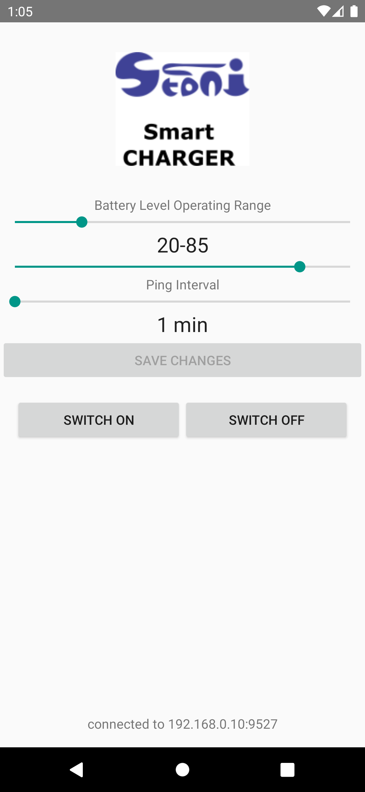

# SmartCharger Android Application

This is simple Xamarin.Android application featuring Foreground service and Splash screen with a TCP/IP socket connection to Raspberry Pi (or any other computer) running Python code and communicating with specific hardware.  
---
Smartcharger is a project designed to provide smart charging capability to any Android phone, using smart outlet, Raspberry Pi with a RF 433MHz transmitter and receiver (for sniffing the codes of specific outlets)
-
[Project Home] https://stonito.link/projects/smartoutlet

