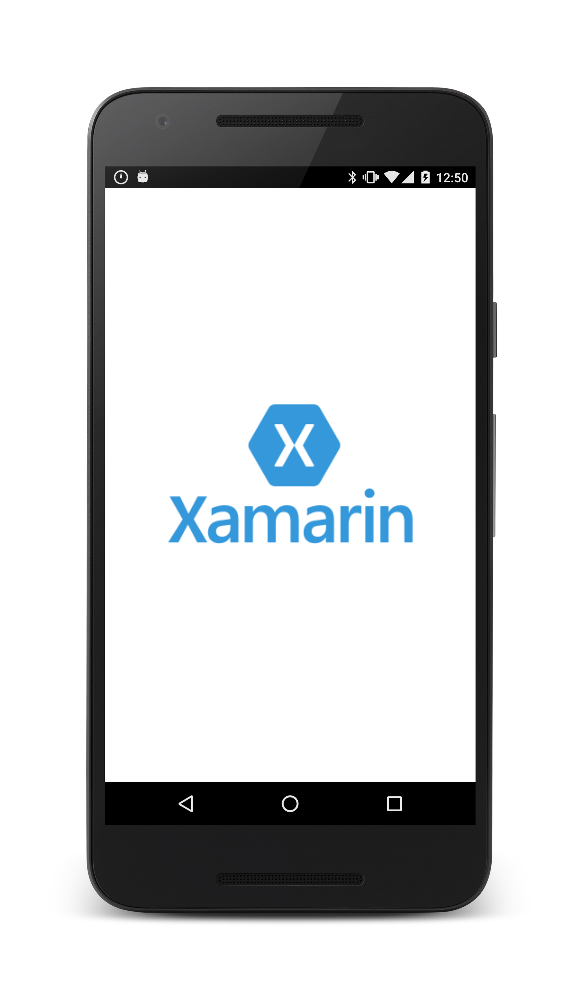

# SmartCharger Xamarin Application

This is simple Xamarin.Android application featuring Foreground service and Splash screen with a TCP/IP socket connection to Raspberry Pi (or any other computer) running Python code and communicating with specific hardware.  

